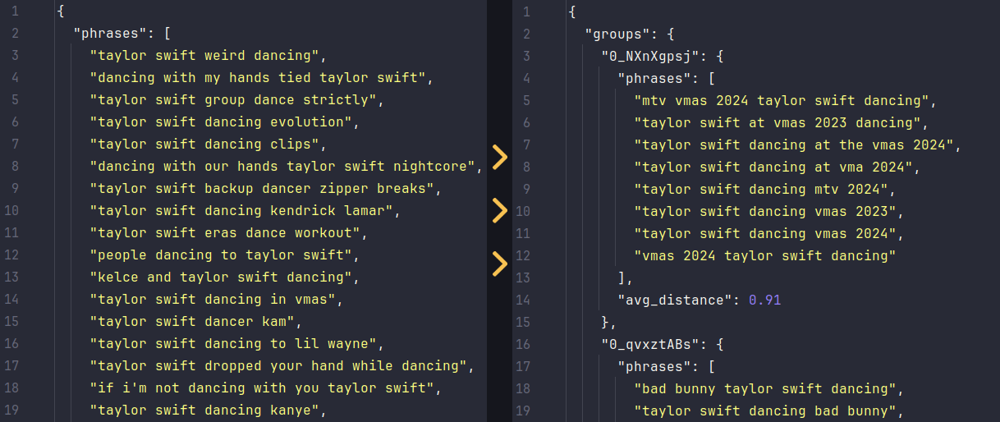

# Search Requests Clusterization Experiment

The solution to clusterize search requests (YouTube, Google, Instagram, etc.) into tighly-related groups to target them with ads or use them to analyze and predict the performance of the content (for example, YouTube videos).

## Goal

- Clusterize search requests into tighly-related groups by meaning and used keywords (not `"satellite" + "space"`, but `"sattelite x" + "sattelite y"`).
- Have the groups of optimal size to keep the focus (not too big, not too small).
- Paralellize/split the load to avoid overloading the system.

## How to use
- Add OpenAI API key (to use for getting embeddings) to the root `.env` file.
- **Option 1**: run `docker compose up` for both backend and frontend.
  - Open `http://localhost:5173/` in the browser or hit `http://localhost:8080` directly.

- **Option 2**:
  - Install requirements through `poetry` (`pyproject.toml`) or `pip` (`requirements.txt`).
  - Run FastAPI `uvicorn web_app.main:app --host 0.0.0.0 --port 8080 --workers 1` from `backend` directory.
  - Run `npm install` and `npm run dev` from `frontend` directory.
  - Open `http://localhost:5173/` in the browser.

## How to configure

All clusterization parameters are stored in `backend/web_app/config.py` file and can be easily changed for the specific needs.

- `EMBEDDINGS_CHUNK_SIZE`: How many embeddings to process at once, when grouping suggestions
- `EMBEDDINGS_CLUSTERING_DISTANCE`: Expected average distance between embeddings to group them
- `EMBEDDINGS_CLUSTERING_ITERATIONS`: How many times to try to group until to stop
- `EMBEDDINGS_CLUSTERING_MAX_RECURSION`: How many times max to re-group singles to increase group count
- `EMBEDDINGS_CLUSTERING_MAX_TAIL_RECURSION`: How many additional recursions allowed if the tail is too large (loose suggestions)
- `EMBEDDINGS_CLUSTERING_DISTANCE_DECREASE`: How to decrease the distance between embeddings to group them with each iteration, to increase the number of groups and improve the user experience
- `EMBEDDINGS_CLUSTERING_MAX_TAIL_ITERATIONS`: How many times to try to group when trying to decrease the tail (too large, loose suggestions)
- `EMBEDDINGS_CLUSTERING_CHUNK_SIZE`: Split embeddings into chunks to speed up clustering
- `SUGGESTIONS_PER_EMBEDDINGS_GROUP`: Expected suggestions per group when grouping embeddings
- `MAX_SUGGESTIONS_PER_EMBEDDINGS_GROUP`: Max suggestions per group to avoid large loosely-related groups
- `EMBEDDINGS_CLUSTERING_MAX_TAIL_PERCENTAGE`: If the tail is larger than that - try to cluster once more with more loose approach